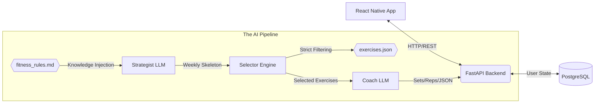

# 🏋️‍♂️ LazyTrainer - AI-Powered Personal Training Agent

> **Status:** 🚀 Fully Functional | Backend + React Native Frontend

**LazyTrainer** is a mobile fitness application that generates hyper-personalized training programs using AI. Unlike standard fitness apps that rely on static templates, LazyTrainer uses a **Custom 3-Step LLM Pipeline** combined with a **Knowledge-Driven Rulebook** to analyze user biometrics, experience level, available equipment, and goals — then builds safe, effective, and evolving routines from a curated exercise catalog.

---

## 🏗️ Architecture

The system utilizes a **Neuro-Symbolic AI** approach (LLM Creativity + Strict Python Logic + Expert Fitness Rulebook) to ensure workout plans are highly personalized and completely free of hallucinations.



## 🛠️ Tech Stack

### Backend & Infrastructure

* **Language:** Python 3.12
* **Framework:** FastAPI (Async)
* **Database:** PostgreSQL (User Profiles & Workout History)
* **ORM:** SQLAlchemy + Alembic (Migrations)
* **AI Orchestrator:** Custom 3-Step LLM Pipeline (OpenAI GPT-4o-mini)
* **Knowledge Base:** `fitness_rules.md` (Expert rulebook injected into AI prompts)
* **Data Storage:** Static JSON Catalog (`exercises.json`)
* **Containerization:** Docker & Docker Compose

### Frontend

* **Framework:** React Native (TypeScript) with Expo
* **Theming:** Custom dual-theme system (Dark Mode / Pink Mode)
* **Communication:** REST API

---

## ⚡ Features

### Core Infrastructure

* [x] **Dockerized Environment:** One-command setup for Database and Services.
* [x] **JSON Exercise Catalog:** Fast, reliable, and strict static storage for all exercises.
* [x] **Database Migrations:** Version control for the DB schema using Alembic.

### AI Pipeline (The "Brain")

* [x] **3-Step Generation:** Strategist (Macro Plan) -> Selector (Strict Filtering) -> Coach (Micro Details).
* [x] **Knowledge-Driven Rules:** Expert fitness rulebook (`fitness_rules.md`) injected into the Strategist to enforce split-type logic based on experience level and goals.
* [x] **Hallucination Guardrails:** Pure Python logic handles exercise selection from the JSON catalog, ensuring the AI cannot invent non-existent exercises.
* [x] **Contextual Equipment Merging:** Deterministic logic handles "Gym" vs "Park" vs "Home" equipment availability.
* [x] **Funny Naming:** Each program gets a humorous animal-themed name (e.g., "The Shredded Flamingo Program").

### Lifecycle Management (The "Trainer")

* [x] **Persistence:** Workout plans and user biometrics are saved to PostgreSQL for historical tracking.
* [x] **Exercise Swapping:** "Swap" endpoint uses Python to find biomechanical equivalents and LLMs to assign sets/reps.
* [x] **Bulk Exercise Replacement:** Select multiple exercises across different days and replace them all at once with the `BulkExerciseSwapper` agent.
* [x] **Restructure Split:** Change your workout split (e.g., Full Body → Push/Pull/Legs) while preserving existing exercises via the exercise pool system.
* [x] **Difficulty Adjustment:** Scale volume or change methods (e.g., Standard → EMOM) on the fly via AI.
* [x] **Progression System:** Generates the *next* month's program based on history, biometrics, and feedback.

### Frontend (React Native)

* [x] **Questionnaire:** Collects user biometrics, goals, experience level, location, equipment, and training days.
* [x] **Workout Display:** Day-by-day view with exercise cards showing sets, reps, rest, method, intensity, and notes.
* [x] **Modify Exercises Mode:** Tap to select exercises across multiple days, then bulk-replace with a floating action button.
* [x] **Change Split Modal:** Choose a new split structure and the AI rebuilds the plan.
* [x] **Dual Theme:** Toggle between Dark Mode and Pink Mode.

---

## 🚀 Getting Started

> For a detailed step-by-step startup guide, see [README_STARTUP.md](./README_STARTUP.md).

### Prerequisites

* Docker Desktop (Running)
* Python 3.12+
* Node.js 18+
* OpenAI API Key

### Quick Start

```bash
# 1. Clone
git clone https://github.com/EmanueleCeglia/LazyTrainerApp.git
cd LazyTrainerApp

# 2. Start Database
docker-compose up -d

# 3. Backend
cd backend
python -m venv venv
venv\Scripts\activate          # Windows
pip install -r requirements.txt

# 4. Create backend/.env (see README_STARTUP.md for contents)

# 5. Run migrations
alembic upgrade head

# 6. Start Backend (use your LAN IP for mobile access)
uvicorn src.main:app --host 0.0.0.0 --port 8000 --reload

# 7. Frontend (new terminal)
cd frontend
npm install
npx expo start
```

---

## 📂 Project Structure

```text
LazyTrainerApp/
├── backend/
│   ├── src/
│   │   ├── api/
│   │   │   ├── routes.py         # API Endpoints (Generate, Swap, Adjust, Restructure, BulkSwap)
│   │   │   └── schemas.py        # Pydantic Models (Input/Output Validation)
│   │   ├── ai/                   # 🧠 THE BRAIN
│   │   │   ├── pipeline.py       # WorkoutPipeline, WorkoutModifier, BulkExerciseSwapper
│   │   │   └── fitness_rules.md  # Expert Fitness Rulebook (Knowledge Base)
│   │   ├── data/
│   │   │   └── exercises.json    # Curated Exercise Catalog
│   │   ├── database/
│   │   │   ├── connection.py     # DB Session
│   │   │   └── models.py        # SQL Tables (UserProfile, WorkoutPlan)
│   │   └── main.py              # App Entry Point
│   ├── alembic/                  # Database Migration scripts
│   ├── .env                      # Secrets (NOT IN GIT)
│   └── alembic.ini
├── frontend/
│   ├── App.tsx                   # Root Component
│   └── src/
│       ├── api/client.ts         # API Client (generate, restructure, bulkSwap)
│       ├── components/Button.tsx # Reusable Button Component
│       ├── screens/
│       │   ├── QuestionnaireScreen.tsx  # User Input Form
│       │   └── WorkoutScreen.tsx       # Plan Display + Edit Mode
│       └── styles/
│           ├── theme.ts          # Design Tokens
│           └── ThemeContext.tsx   # Dark/Pink Mode Provider
├── docker-compose.yml
├── DEVELOPER_GUIDE.md
├── README_STARTUP.md
└── README.md
```

---

## 📄 License

This project is licensed under the MIT License.