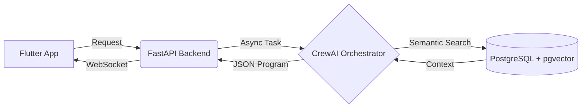

# 🏋️‍♂️ LazyTrainer - AI-Powered Personal Training Agent

> **Status:** 🚧 In Development (Backend Architecture Phase)

**LazyTrainer** is a State-of-the-Art (SoTA) application designed to generate hyper-personalized training programs. Unlike standard fitness apps that rely on static templates, LazyTrainer uses an **Agentic AI** architecture to analyze user biomechanics, injuries, and goals, retrieving verified exercises from a vector database to build safe, effective routines.

---

## 🏗️ Architecture

The system utilizes an **Asynchronous Event-Driven Architecture** to handle long-running AI tasks without freezing the user interface.



## 🛠️ Tech Stack

### Backend & Infrastructure

* **Language:** Python 3.12
* **Framework:** FastAPI (Async)
* **Database:** PostgreSQL (with `pgvector` extension)
* **ORM:** SQLAlchemy + Alembic (Migrations)
* **AI Orchestrator:** CrewAI (Multi-Agent Systems) *[In Progress]*
* **Containerization:** Docker & Docker Compose

### Frontend (Planned)

* **Framework:** Flutter (Dart)
* **State Management:** Riverpod
* **Communication:** WebSockets (Real-time agent feedback)

---

## ⚡ Features

* [x] **Dockerized Environment:** One-command setup for Database and Services.
* [x] **Vector Database:** Schema designed for semantic search of exercises (RAG).
* [x] **Clean Architecture:** Modular code structure (`api`, `crew`, `database`).
* [x] **Database Migrations:** Version control for the DB schema using Alembic.
* [ ] **Agentic Workflow:** "Biomechanics" and "Programmer" agents.
* [ ] **Mobile Interface:** iOS/Android app.

---

## 🚀 Getting Started

### Prerequisites

* Docker Desktop (Running)
* Python 3.12+

### 1. Clone & Setup

```bash
git clone [https://github.com/EmanueleCeglia/LazyTrainerApp.git](https://github.com/EmanueleCeglia/LazyTrainerApp.git)
cd LazyTrainerApp

```

### 2. Infrastructure (Start Database)

Start the PostgreSQL container with pgvector support:

```bash
docker-compose up -d

```

### 3. Backend Setup

```bash
cd backend
python -m venv venv

# Windows
venv\Scripts\activate
# Mac/Linux
source venv/bin/activate

pip install -r requirements.txt

```

### 4. Database Initialization

Apply the migrations to create tables in the running container:

```bash
alembic upgrade head

```

### 5. Run the Server

```bash
uvicorn src.main:app --reload

```

* **API URL:** `http://127.0.0.1:8000`
* **Swagger Documentation:** `http://127.0.0.1:8000/docs`

---

## 📂 Project Structure

```text
LazyTrainerApp/
├── backend/
│   ├── src/
│   │   ├── api/          # FastAPI Routes (Endpoints) & Schemas (Pydantic)
│   │   ├── crew/         # AI Agents & Tools logic
│   │   ├── database/     # DB Connection & SQLAlchemy Models
│   │   └── main.py       # Application Entry Point
│   ├── alembic/          # Database Migration scripts
│   └── requirements.txt  # Python Dependencies
├── frontend/             # Flutter Application (Coming Soon)
├── docker-compose.yml    # Infrastructure orchestration
└── README.md

```

---

## 📄 License

This project is licensed under the MIT License.
